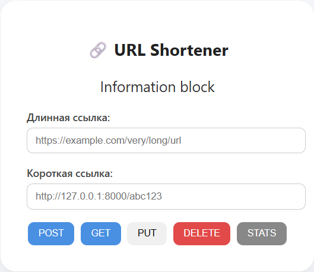

# URL Shortening Service 🧩
[](LICENSE)
RESTful API приложение, которое позволяет быстро создавать короткие ссылки и вести статистику переходов по ним. Это реализация одной из множества идей портала [roadmap.sh](https://roadmap.sh/projects/url-shortening-service).

---
## 📸 Скриншот


---
## 🎯 Возможности

- Генерация коротких ссылок
- Перенаправление с короткой ссылки на оригинальный URL    
- Ведение статистики переходов
- Валидация URL
- Изменение оригинальной ссылки у существующей короткой
- удаление короткой ссылки

---
## 📂 Структура проекта
```
.  
├── app/  
│ ├── Dockerfile  
│ ├── pyproject.toml  
│ ├── requirements.txt # Список зависимостей
│ ├── shorten/
│ │ ├── __init__.py  
│ │ ├── main.py  
│ │ ├── models.py
│ │ ├── settings.py
│ │ └── utilities.py
│ ├── static/
│ │ ├── retrieve.js  
│ │ ├── script.js  
│ │ └── style.css  
│ ├── templates/  
│ │ ├── index.html
│ │ └── retrieve.html
│ └── uv.lock # Файл блокировки зависимостей  
├── compose.yml # Docker Compose  
├── env_example # Пример настроек окружения  
├── LICENSE
├── README.md  
└── screenshot.png # Скриншот интерфейса
```

---
## 🛠 Установка и запуск

1. Скопируй файл `env_example` в `.env` и настрои переменные (порт, база данных и т.д.).  
2. (Опционально) Запусти Docker контейнеры через compose:
```bash
docker-compose up --build
````
---
## 🔄 Примеры API

| Метод  | Путь                            | Описание                            | Пример тела запроса                               |
| ------ | ------------------------------- | ----------------------------------- | ------------------------------------------------- |
| POST   | `/shorten`                      | Создать короткую ссылку             | `{ "url": "https://example.com/some_long_url", }` |
| GET    | `/shorten/some_short_url`       | Перенаправление на оригинальный URL | —                                                 |
| PUT    | `/shorten/some_short_url`       | Изменить оригинальную ссылку        | `{ "url": "https://example.com/some_long_url", }` |
| GET    | `/shorten/some_short_url/stats` | Получить статистику                 |                                                   |
| DELETE | `/shorten/some_short_url`       | Удалить короткую ссылку             |                                                   |

**Пример ответа:**

```json
{
  "id": "1",
  "url": "https://www.example.com/some/long/url",
  "shortCode": "abc123",
  "createdAt": "2021-09-01T12:00:00Z",
  "updatedAt": "2021-09-01T12:00:00Z"
}
```

---

## ✅ Проверка и тесты

*(если ты добавишь тесты — укажи здесь как их запускать: jest, mocha и т.д.)*

```bash
test
```

---
## 📈 Стек технологий

* FastAPI
* PostgreSQL
* ORM SqlAlchemy
* Docker
* JS
* CCS3
* HTML5
* Jinja2

---
## 📄 Лицензия

Этот проект лицензирован под [MIT License](LICENSE).

---
## ✍🏼 Контакты / Благодарности

Если хочешь связаться или внести вклад — открывай issue или pull request.
Большое спасибо за интерес к проекту!
